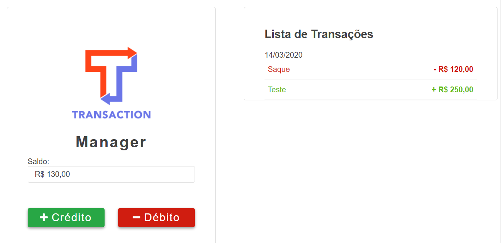

# Transactions Manager

> Sistema simples de cadastro de transações financeiras.

Dentro do sistema é possível cadastrar créditos e débitos, ver o saldo e acompanhas a lista de transações que foram efetuadas.



## Instalação

**É necessário ter o npm ou yarn instalado.**

Baixe o projeto para a sua máquina:

```sh
https://github.com/mvcbotelho/transactions-manager.git
```

Instale as dependencias

```sh
npm i ou
yarn
```

Para iniciar o proejto

```sh
npm start ou
yarn start
```

## Contato

Marcus Botelho – marcus.itec@gmail.com

Distribuído sob a licença MIT.
